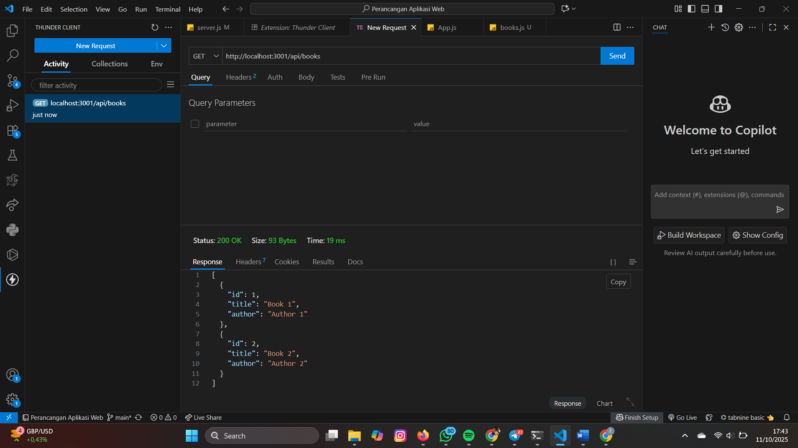
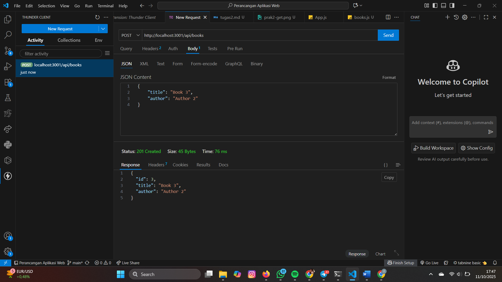
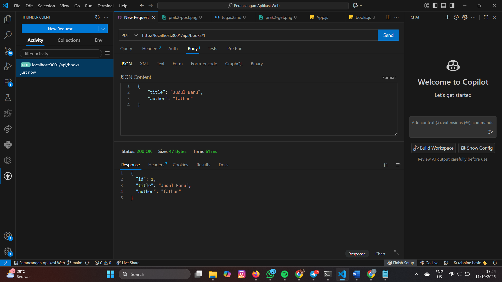
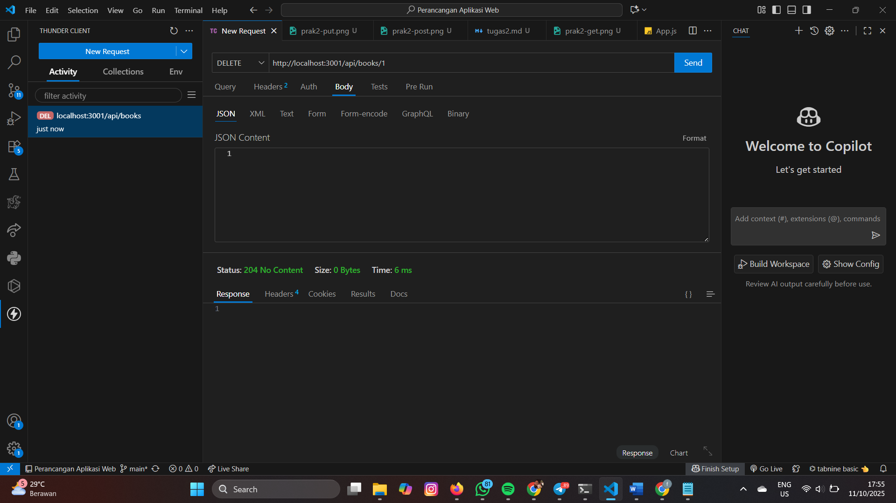
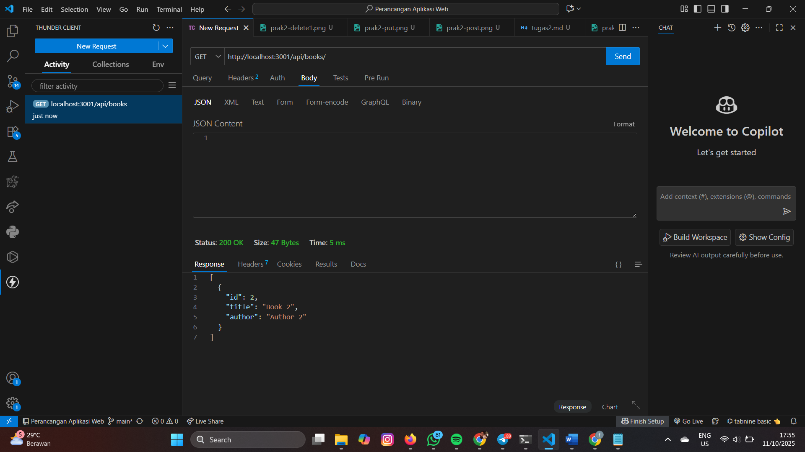

# Dokumentasi Tugas 2: Pengujian API CRUD Sederhana

Dokumen ini merangkum hasil pengujian (*screenshot*) dari implementasi API **Create, Read, Update, Delete (CRUD)** untuk entitas **Buku** menggunakan **Express.js**.

Semua pengujian dilakukan melalui *client* dengan *endpoint* dasar `/api/books`.

---

## 1. READ (GET)

**Tujuan:** Mengambil semua daftar buku yang tersedia.

| Endpoint | Method | Keterangan | Hasil Uji (Screenshot) |
| :--- | :--- | :--- | :--- |
| `/api/books` | **GET** | Mengambil semua data buku. | **[prak2-get.png](ss/prak2-get.png)** |

**Tampilan Hasil Uji GET:**

---

## 2. CREATE (POST)

**Tujuan:** Menambahkan buku baru ke dalam daftar.

| Endpoint | Method | Keterangan | Hasil Uji (Screenshot) |
| :--- | :--- | :--- | :--- |
| `/api/books` | **POST** | Mengirim data buku baru (title, author) di *body* JSON. | **[prak2-post.png](ss/prak2-post.png)** |

**Tampilan Hasil Uji POST:**

---

## 3. UPDATE (PUT)

**Tujuan:** Memperbarui data buku yang sudah ada berdasarkan ID.

| Endpoint | Method | Keterangan | Hasil Uji (Screenshot) |
| :--- | :--- | :--- | :--- |
| `/api/books/:id` | **PUT** | Mengirimkan data perubahan untuk buku dengan ID tertentu. | **[prak2-put.png](ss/prak2-put.png)** |

**Tampilan Hasil Uji PUT:**

---

## 4. DELETE (DELETE)

**Tujuan:** Menghapus buku yang sudah ada berdasarkan ID.

| Endpoint | Method | Keterangan | Hasil Uji (Screenshot) |
| :--- | :--- | :--- | :--- |
| `/api/books/:id` | **DELETE** | Menghapus buku dan menerima status **204 No Content**. | **[prak2-delete1.png](ss/prak2-delete1.png)** |
| `/api/books/:id` | **GET** | Verifikasi (optional) bahwa buku yang dihapus tidak lagi muncul di daftar. | **[prak2-delete2.png](ss/prak2-delete2.png)** |

**Tampilan Hasil Uji DELETE dan Verifikasi:**

### 4a. Hasil Permintaan DELETE (204 No Content)

### 4b. Hasil Verifikasi GET setelah DELETE (Buku telah terhapus)
