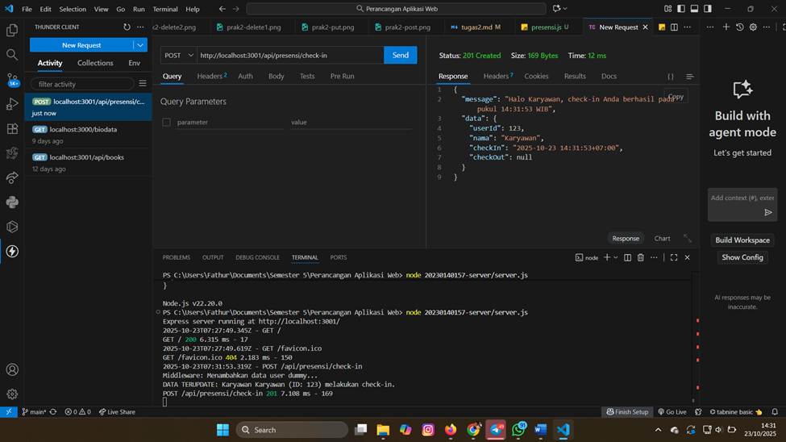
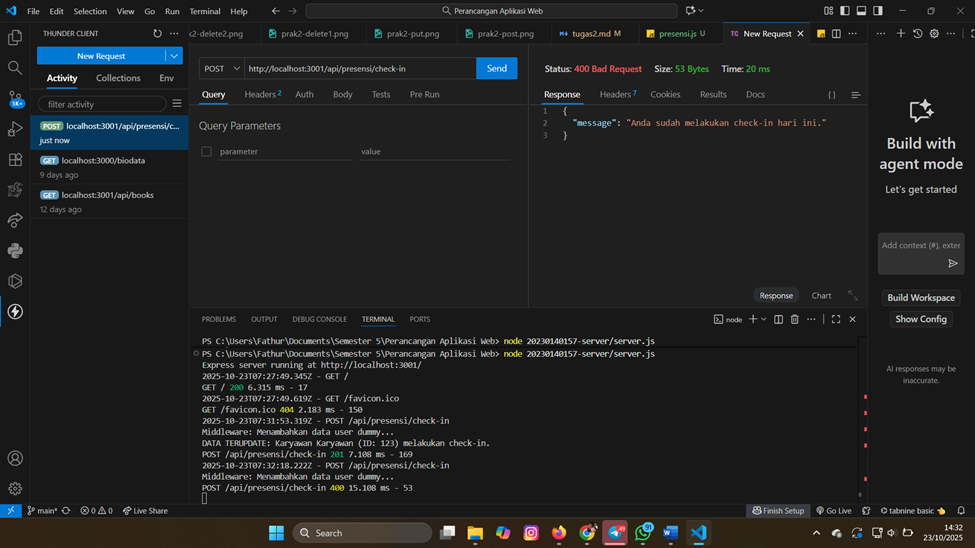
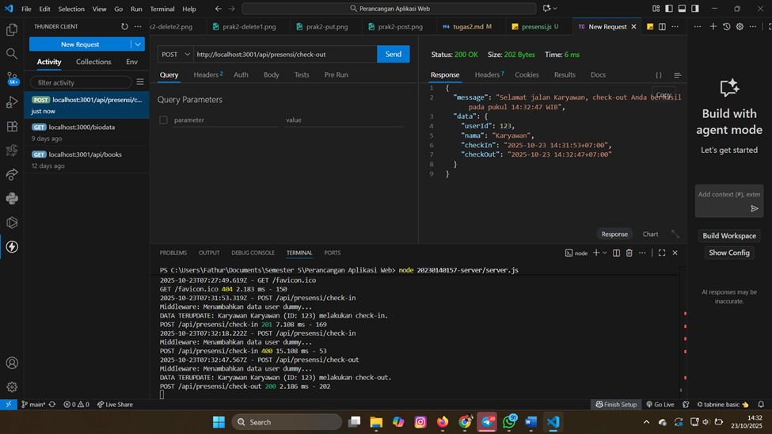
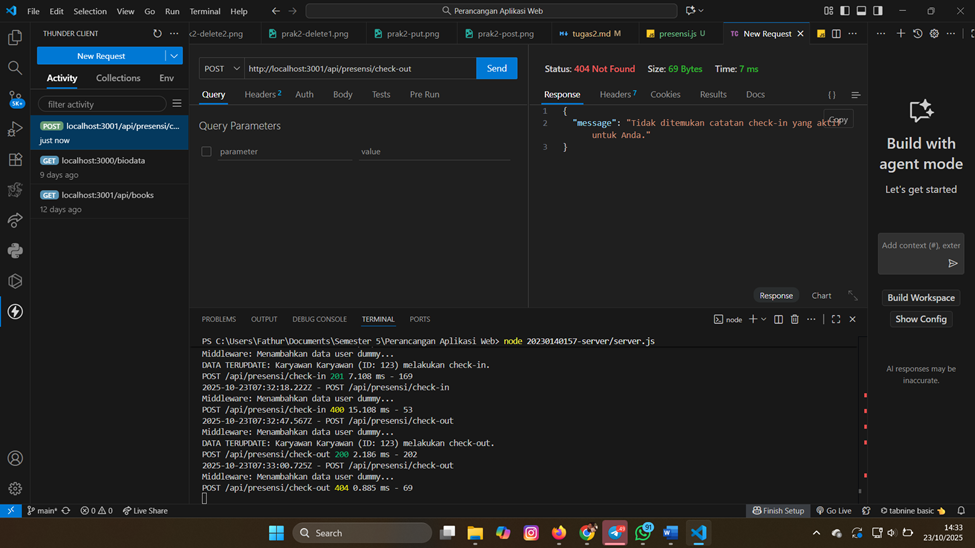
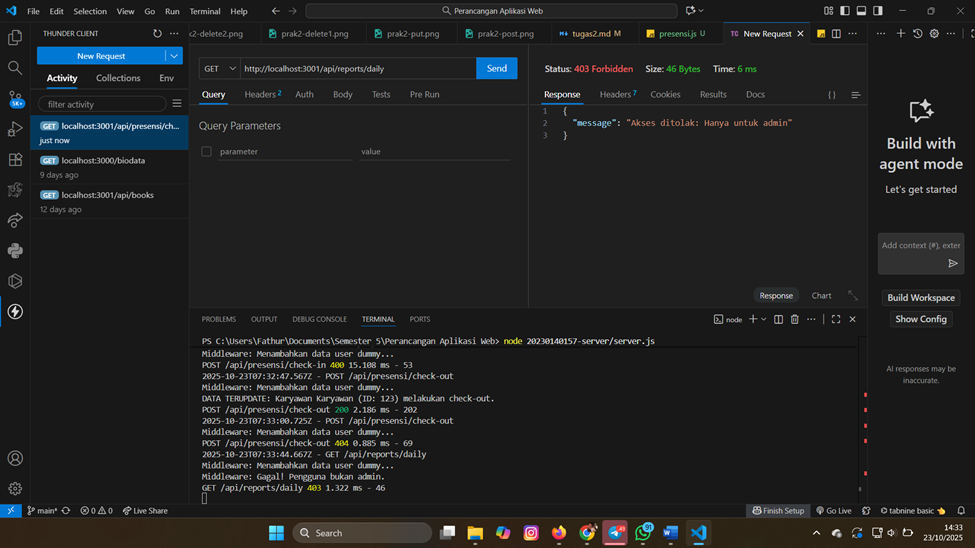
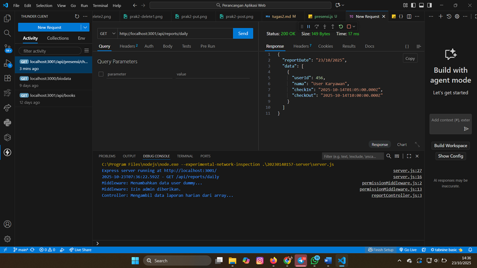

# Dokumentasi Tugas 3: Pengujian API Presensi Karyawan Sederhana

Dokumen ini merangkum hasil pengujian (*screenshot*) dari implementasi API **Presensi Karyawan (Check-in, Check-out, dan Laporan)** menggunakan **Express.js**.

Semua pengujian dilakukan melalui **Thunder Client** dengan asumsi *middleware* otentikasi/otorisasi telah mensimulasikan data pengguna (`userId: 123`, `nama: Karyawan`, dll. untuk pengujian non-admin, dan user admin untuk pengujian laporan sukses).

---

## 1. POST (Check-in)

**Tujuan:** Mencatat waktu masuk (Check-in) karyawan.

| Endpoint | Method | Keterangan | Hasil Uji (Screenshot) |
| :--- | :--- | :--- | :--- |
| `/api/presensi/check-in` | **POST** | Mencatat *check-in* baru. | **[check-in.png](ss3/check-in.png)** |

**Tampilan Hasil Uji POST (Check-in Berhasil):**
*Status HTTP: 201 Created*

---

## 2. POST (Check-in Gagal - Sudah Check-in)

**Tujuan:** Menguji penolakan ketika karyawan mencoba *check-in* kedua kali di hari yang sama.

| Endpoint | Method | Keterangan | Hasil Uji (Screenshot) |
| :--- | :--- | :--- | :--- |
| `/api/presensi/check-in` | **POST** | Mencoba *check-in* lagi. | **[check-in2.png](ss3/check-in2.png)** |

**Tampilan Hasil Uji POST (Check-in Gagal):**
*Status HTTP: 400 Bad Request*

---

## 3. POST (Check-out)

**Tujuan:** Mencatat waktu keluar (Check-out) karyawan.

| Endpoint | Method | Keterangan | Hasil Uji (Screenshot) |
| :--- | :--- | :--- | :--- |
| `/api/presensi/check-out` | **POST** | Mencatat *check-out* untuk sesi *check-in* yang sudah ada. | **[check-out.png](ss3/check-out.png)** |

**Tampilan Hasil Uji POST (Check-out Berhasil):**
*Status HTTP: 200 OK*

---

## 4. POST (Check-out Gagal - Belum Check-in / Sesi Selesai)

**Tujuan:** Menguji penolakan ketika karyawan mencoba *check-out* tanpa *check-in* aktif.

| Endpoint | Method | Keterangan | Hasil Uji (Screenshot) |
| :--- | :--- | :--- | :--- |
| `/api/presensi/check-out` | **POST** | Mencoba *check-out* kedua kali/tanpa *check-in* aktif. | **[check-out2.png](ss3/check-out2.png)** |

**Tampilan Hasil Uji POST (Check-out Gagal):**
*Status HTTP: 404 Not Found*

---

## 5. GET (Laporan Harian - Akses Ditolak)

**Tujuan:** Mengambil laporan harian presensi, tetapi pengguna yang mengakses **bukan** admin.

| Endpoint | Method | Keterangan | Hasil Uji (Screenshot) |
| :--- | :--- | :--- | :--- |
| `/api/reports/daily` | **GET** | Akses laporan harian oleh user non-admin. | **[karyawan.png](ss3/karyawan.png)** |

**Tampilan Hasil Uji GET (Laporan Gagal Otorisasi):**
*Status HTTP: 403 Forbidden*

---

## 6. GET (Laporan Harian - Akses Berhasil)

**Tujuan:** Mengambil laporan harian presensi, diakses oleh pengguna yang **sudah** terotentikasi sebagai admin.

| Endpoint | Method | Keterangan | Hasil Uji (Screenshot) |
| :--- | :--- | :--- | :--- |
| `/api/reports/daily` | **GET** | Akses laporan harian oleh user admin. | **[admin.png](ss3/admin.png)** |

**Tampilan Hasil Uji GET (Laporan Berhasil):**
*Status HTTP: 200 OK*

